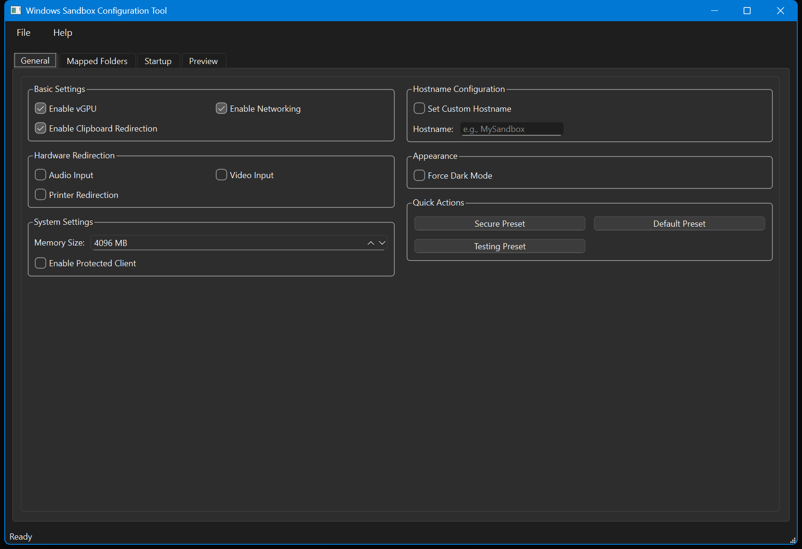
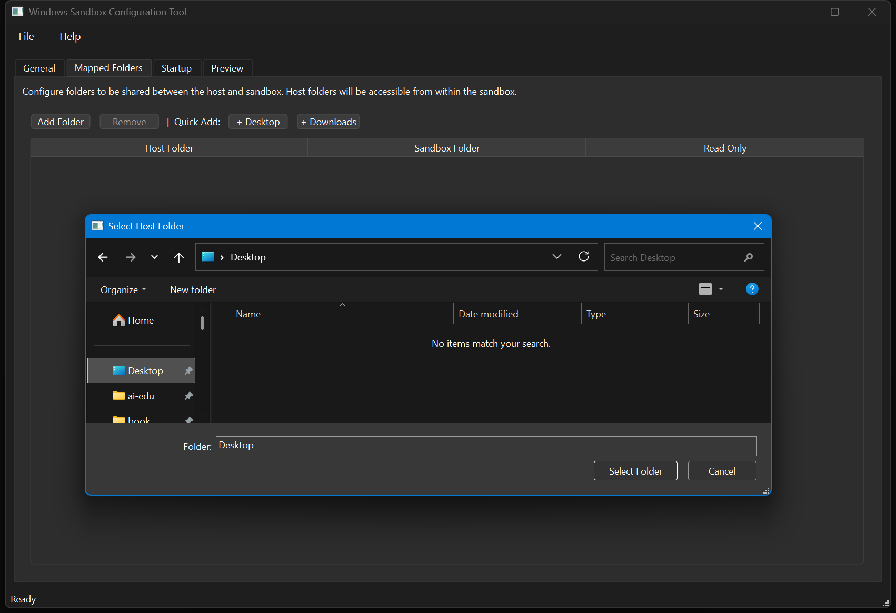
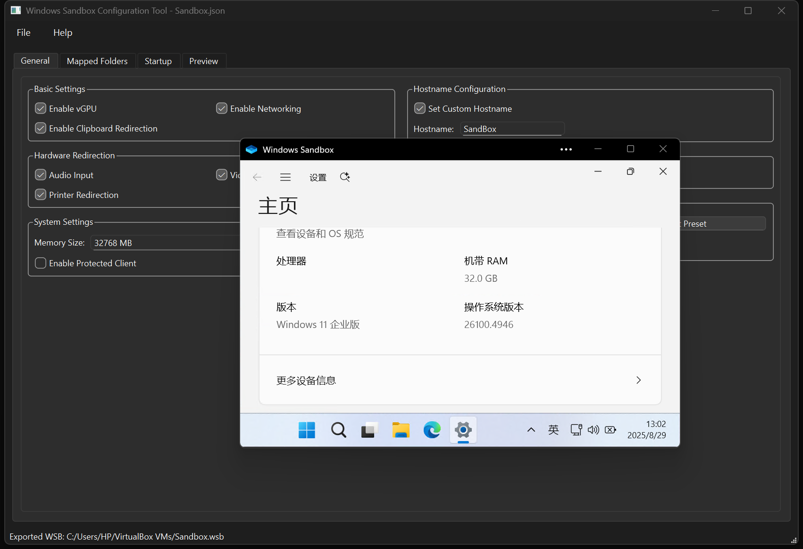

# Windows Sandbox Configuration Tool

[](https://www.python.org/downloads/)
[](https://pypi.org/project/PySide6/)
[](LICENSE)
[](https://www.microsoft.com/windows)

A powerful and user-friendly GUI tool for creating and managing Windows Sandbox configuration files (.wsb). This tool provides an intuitive interface to configure all Windows Sandbox options without manually editing XML files.

## 📸 Screenshots

### Main Interface

*General settings tab with two-column layout for better space utilization*

### Mapped Folders Configuration

*Easy folder mapping with quick-add buttons for common directories*

### Startup Commands

*Configure startup commands with built-in examples and quick buttons*

### Live Preview

*Real-time XML preview of your configuration*

### Export and Run

*Export your configuration and launch Windows Sandbox directly*


*Windows Sandbox running with your custom configuration*

## ✨ Features

### 🎯 **Core Configuration Options**
- **Virtual GPU (vGPU)**: Enable/disable hardware acceleration
- **Networking**: Control internet access
- **Audio Input**: Microphone access control
- **Video Input**: Camera access control
- **Printer Redirection**: Printer sharing
- **Clipboard Redirection**: Copy/paste between host and sandbox
- **Protected Client**: Enhanced security mode
- **Memory Allocation**: Custom RAM assignment (512MB - 32GB)
- **Custom Hostname**: Set sandbox computer name [Not Working]
- **Force Dark Mode**: Enable dark theme in sandbox [Not Available]

### 📁 **Advanced Folder Mapping**
- Drag-and-drop folder selection
- Quick-add buttons for Desktop and Downloads
- Read-only/read-write permissions
- Custom sandbox paths
- Multiple folder support

### 🚀 **Startup Commands**
- Custom application launch
- Quick command buttons (CMD, PowerShell, Explorer)
- File browser for easy executable selection
- Batch file support
- Command examples and tips

### ⚡ **Quick Presets**
- **Secure Preset**: Isolated environment for malware analysis
- **Default Preset**: Balanced settings for general use
- **Testing Preset**: Full access for software development

### 💾 **Configuration Management**
- Save/load configurations as JSON
- Export to .wsb files
- Direct sandbox launch
- Configuration templates
- Settings persistence

### 🎨 **Modern UI/UX**
- Two-column layout for optimal space usage
- Compact controls and groupings
- Real-time XML preview
- Tooltips and help text
- Responsive design
- Dark theme support

## 🛠️ Installation

### Prerequisites

1. **Windows 10/11 Pro, Enterprise, or Education**
   - Windows Sandbox must be enabled
   - Virtualization support required

2. **Python 3.7 or higher**
   ```bash
   python --version
   ```

3. **PySide6**
   ```bash
   pip install PySide6
   ```

### Enable Windows Sandbox

1. Open **Turn Windows features on or off**
2. Check **Windows Sandbox**
3. Restart your computer

### Download and Run

1. **Clone the repository**
   ```bash
   git clone https://github.com/yourusername/SandboxGUI.git
   cd SandboxGUI
   ```

2. **Install dependencies**
   ```bash
   pip install PySide6
   ```

3. **Run the application**
   ```bash
   python SandBoxGUI.py
   ```

## 🎯 Quick Start Guide

### 1. Basic Configuration
1. Launch the application
2. Configure basic settings in the **General** tab
3. Use preset buttons for quick setup:
   - **Secure Preset**: For testing suspicious files
   - **Default Preset**: For general sandbox use
   - **Testing Preset**: For development work

### 2. Add Shared Folders
1. Go to **Mapped Folders** tab
2. Click **Add Folder** or use quick buttons:
   - **+ Desktop**: Share your desktop
   - **+ Downloads**: Share downloads folder
3. Configure read-only permissions as needed

### 3. Set Startup Commands
1. Switch to **Startup** tab
2. Use quick buttons or browse for custom executables:
   - **CMD**: Command Prompt
   - **PowerShell**: Windows PowerShell
   - **Explorer**: File Explorer

### 4. Preview and Export
1. Check **Preview** tab for XML output
2. Go to **File** → **Export WSB...**
3. Choose to launch sandbox immediately

## 📋 Configuration Options Reference

### General Settings
| Option | Description | Default |
|--------|-------------|----------|
| vGPU | Hardware acceleration | Enabled |
| Networking | Internet access | Enabled |
| Audio Input | Microphone access | Disabled |
| Video Input | Camera access | Disabled |
| Printer Redirection | Printer sharing | Disabled |
| Clipboard Redirection | Copy/paste | Enabled |
| Protected Client | Enhanced security | Disabled |
| Memory | RAM allocation | 4096 MB |
| Custom Hostname | Computer name | Disabled |
| Force Dark Mode | Dark theme | Disabled |

### XML Output Example
```xml
<Configuration>
  <VGpu>Enable</VGpu>
  <Networking>Enable</Networking>
  <MappedFolders>
    <MappedFolder>
      <HostFolder>C:\Users\Username\Desktop</HostFolder>
      <SandboxFolder>C:\Users\WDAGUtilityAccount\Desktop\Shared</SandboxFolder>
      <ReadOnly>false</ReadOnly>
    </MappedFolder>
  </MappedFolders>
  <LogonCommand>
    <Command>C:\Windows\System32\cmd.exe</Command>
  </LogonCommand>
  <HostName>MySandbox</HostName>
  <WindowsAppTheme>Dark</WindowsAppTheme>
</Configuration>
```

## 🔧 Advanced Usage

### Custom Configurations
- Save frequently used configurations as JSON
- Create configuration templates for different scenarios
- Share configurations with team members

### Security Best Practices
- Use **Secure Preset** for untrusted files
- Disable networking when not needed
- Keep sandbox files in mapped folders only
- Regular cleanup of sandbox configurations

### Development Workflow
- Use **Testing Preset** for development
- Map source code directories
- Enable all hardware redirection for testing
- Use startup commands to launch development tools

## 🐛 Troubleshooting

### Common Issues

**Windows Sandbox not available**
- Ensure Windows 10/11 Pro, Enterprise, or Education
- Enable Windows Sandbox feature
- Check virtualization support in BIOS

**Application won't start**
- Verify Python 3.7+ installation
- Install PySide6: `pip install PySide6`
- Check Windows permissions

**Mapped folders not working**
- Verify folder paths exist
- Check folder permissions
- Ensure paths use backslashes on Windows

**WSB file won't launch**
- Verify Windows Sandbox is enabled
- Check XML syntax in Preview tab
- Ensure file has .wsb extension

### Getting Help
- Check the **About** dialog for version info
- Use tooltips for control explanations
- Refer to [Microsoft's Windows Sandbox documentation](https://docs.microsoft.com/en-us/windows/security/threat-protection/windows-sandbox/windows-sandbox-overview)

## 🤝 Contributing

Contributions are welcome! Please feel free to submit a Pull Request. For major changes, please open an issue first to discuss what you would like to change.

### Development Setup
1. Fork the repository
2. Create a feature branch
3. Make your changes
4. Test thoroughly
5. Submit a pull request

## 📝 License

This project is licensed under the GNU General Public License v3.0 - see the [LICENSE](LICENSE) file for details.

## 🙏 Acknowledgments

- Microsoft for Windows Sandbox technology
- Qt/PySide6 development team
- Python community for excellent libraries
- Contributors and users for feedback

## 📞 Support

If you find this tool helpful, please consider:
- ⭐ Starring the repository
- 🐛 Reporting bugs via Issues
- 💡 Suggesting new features
- 🤝 Contributing code improvements

---

**Made with ❤️ for the Windows security community**
