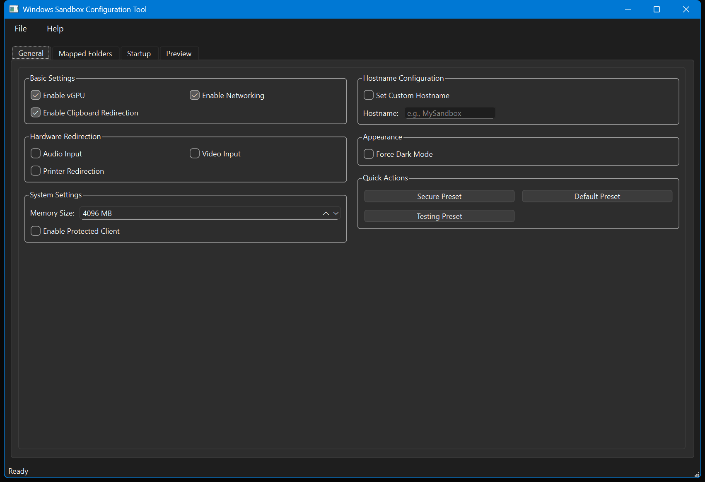
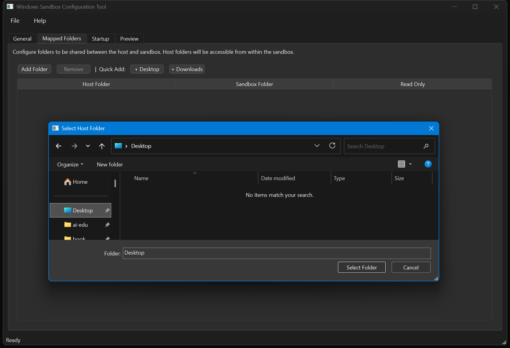
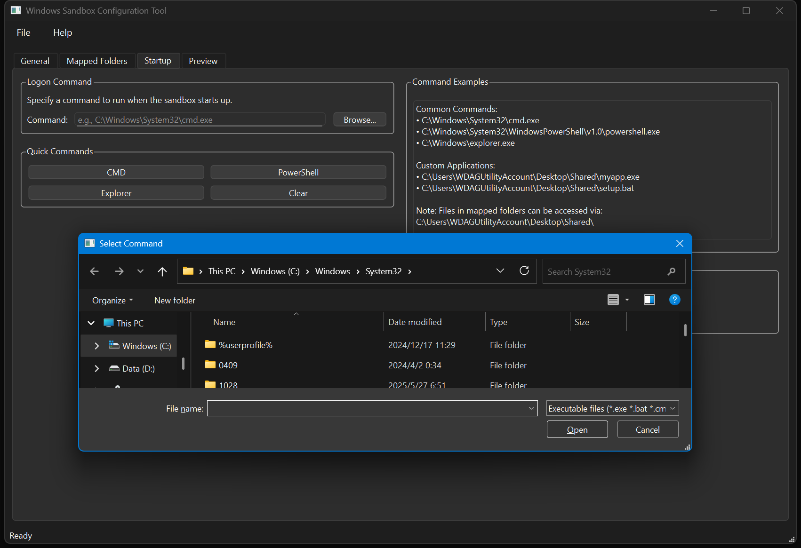
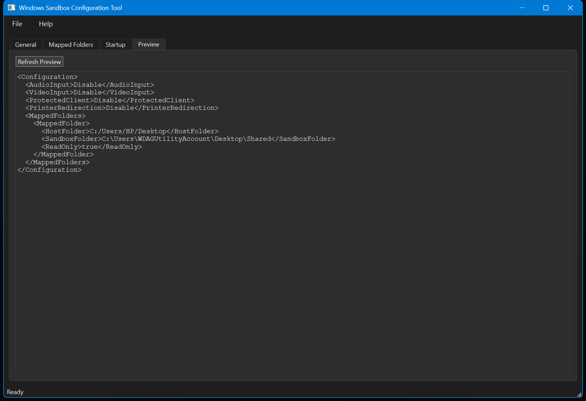

# Windows 沙盒配置工具

[](https://www.python.org/downloads/)
[](https://pypi.org/project/PySide6/)
[](LICENSE)
[](https://www.microsoft.com/windows)

一个功能强大且用户友好的图形界面工具，用于创建和管理 Windows 沙盒配置文件（.wsb）。提供直观的界面配置所有沙盒选项，无需手动编辑 XML 文件。

## 📸 界面截图






## ✨ 功能特性

### 🎯 核心配置

- **虚拟 GPU**：硬件加速控制
- **网络连接**：互联网访问控制
- **硬件重定向**：音频、视频、打印机、剪贴板
- **内存分配**：512MB - 32GB 自定义分配
- **自定义主机名**：设置沙盒计算机名【暂时未实现】
- **强制深色模式**：启用深色主题【没办法实现了】

### 📁 文件夹映射

- 拖放式文件夹选择
- 桌面/下载文件夹快速添加
- 只读/读写权限控制
- 多文件夹支持

### 🚀 启动命令

- CMD、PowerShell、资源管理器快捷按钮
- 自定义可执行文件浏览
- 批处理文件支持

### ⚡ 快速预设

- **安全预设**：隔离环境，禁用网络
- **默认预设**：平衡的通用设置
- **测试预设**：开发环境，全功能启用

### 💾 配置管理

- JSON 格式保存/加载
- 导出 .wsb 文件
- 直接启动沙盒
- 实时 XML 预览

## 🛠️ 安装

### 系统要求

- Windows 10/11 专业版/企业版/教育版
- Python 3.7+
- 启用 Windows 沙盒功能

### 安装步骤

```bash
# 1. 克隆仓库
git clone https://github.com/yourusername/SandboxGUI.git
cd SandboxGUI

# 2. 安装依赖
pip install PySide6

# 3. 运行程序
python SandBoxGUI.py
```

## 🎯 快速开始

1. **基本配置**：选择预设或自定义设置
2. **文件夹映射**：添加需要共享的文件夹
3. **启动命令**：设置沙盒启动时运行的程序
4. **导出运行**：导出 .wsb 文件并启动沙盒

## 📋 配置选项

| 选项     | 描述       | 默认值  |
| -------- | ---------- | ------- |
| vGPU     | 硬件加速   | 启用    |
| 网络     | 互联网访问 | 启用    |
| 剪贴板   | 复制粘贴   | 启用    |
| 内存     | RAM 分配   | 4096 MB |
| 主机名   | 计算机名   | 禁用    |
| 深色模式 | 深色主题   | 禁用    |

## 🐛 故障排除

**沙盒不可用**

- 检查 Windows 版本（需专业版+）
- 启用 Windows 沙盒功能
- 确认 BIOS 中虚拟化已启用

**程序无法运行**

- 确认 Python 3.7+ 已安装
- 安装 PySide6：`pip install PySide6`

**文件夹映射失败**

- 检查文件夹路径和权限
- 使用反斜杠路径格式

## 🤝 贡献

欢迎提交 Issue 和 Pull Request！

## 📝 许可证

GNU General Public License v3.0 - 详见 [LICENSE](LICENSE)

---

**为 Windows 安全社区制作 ❤️**"
